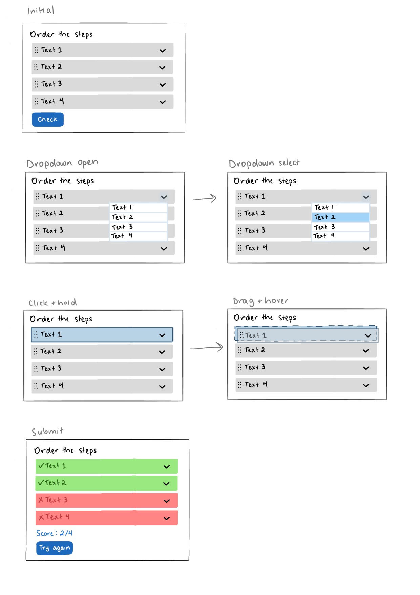

# Sort the Paragraphs

A plugin where users can rearrange texts in the correct order.

## Current Features

This plugin supports the following features:

- Dragging texts into different positions
- Placing texts in each position by selecting them in a dropdown
- Submitting answers and viewing the results (each text will be marked as correct or incorrect based on its position)
- Displaying the score of the attempt
- Restarting the widget to try again

## Data Format

To display the plugin correctly, the widget requires a `data` object/dictionary containing the following keys:

- `question` (`string`): The question to display at the top of the widget
- `texts` (`array<string>` or `list<string>`): The list of texts to rearrange, given _in the correct order_
    - The texts will be shuffled before displaying in the widget, but the sequence of texts provided will be used for verifying the results
    - Any number of texts can be provided

Sample:
```
{
    "question": "YOUR_QUESTION_HERE",
    "texts": [
        "TEXT1",
        "TEXT2",
        "TEXT3",
        "TEXT4"
    ]
}
```

## Developing

The JS and CSS files for developing the sort the paragraphs plugin can be found under `cassandratin13/sort_paragraphs_plugin`. For testing an example notebook with this plugin, run `marimo edit sort_paragraphs.py` within the same directory. To view the version requiring backend support, follow the [instructions](https://github.com/gvwilson/mossball/blob/main/CONTRIBUTING.md) to set up the backend and database.

You can call the following functions defined in `frontend/widgets.py` to create a multiple choice widget:

- `create_stp` - using backend support ("question_num" must be defined by the institition backend)
- `create_local_stp` - without backend support, simply pass in the data directly or upload the data via a JSON file
- `create_widget` - without backend support, simply pass in the plugin type and data directly or upload via a JSON file

## Mockups



## Possible Enhancements

- Giving the option to keep the correct answers in place after restarting, so that only the texts that haven't been placed correctly yet can be moved


