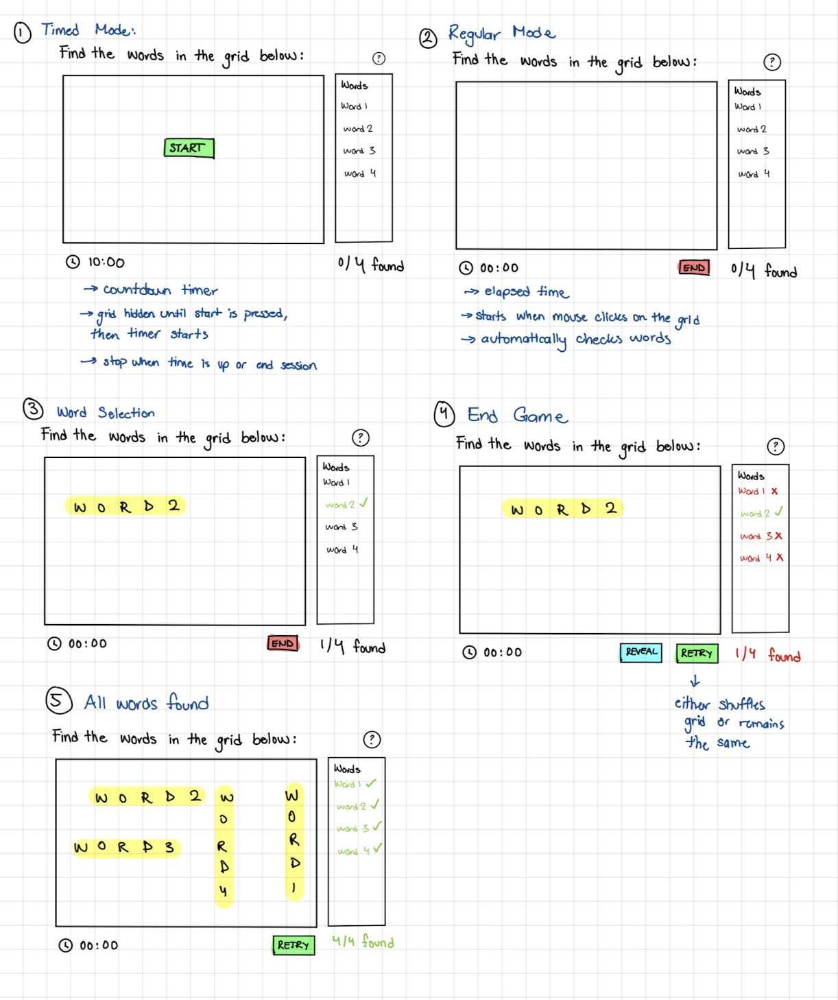

# Find the Words

The widget front-end code bundles it's JavaScript dependencies. After setting up Python,
make sure to install these dependencies locally if there is no `node_modules` directory:

```
npm i
```

While developing, you can run the following in a separate terminal to automatically
rebuild JavaScript as you make changes:

```
npm run dev
```

The javascript code for this plugin can be found in `js/`, with `widget.js` containing the main driver code for the widget. All styles are in `widget.css`

## Data Format 

The plugin accepts a `data` object for configurations:

- `title` (`string`): The title of the word search.  
- `words` (`array<string>`): A list of words that need to be found in the grid.  
- `instructions` (`string`): A brief description of how to play the game.  
- `config` (`object`): Configuration settings for the game. *(See "Config Object" below.)*  

### Config Object (`config`)  

- `gridWidth` (`integer`): The width of the word search grid in number of cells. *(Grid constraints must fit the longest word)*  
- `gridHeight` (`integer`): The height of the word search grid in number of cells.  
- `gameMode` (`object`): Settings related to game timing. *(See "Game Mode Object" below.)*  
- `barColor` (`string`): The color of the selection bar (any valid CSS color).  
- `seed` (`integer`, optional): A number to ensure the grid remains the same across different runs. Useful for testing.

### Game Mode Object (`config.gameMode`)  

- `timed` (`boolean`): Whether the game is timed or not. Untimed mode will display an elapsed timer.  
- `countdown` (`integer`): Countdown duration in seconds *(ignored if `timed` is `false`)*.

Sample:
```
{
  "title": "YOUR_GAME_TITLE_HERE",
  "words": ["WORD_1", "WORD_2", "WORD_3", "WORD_4"],
  "instructions": "YOUR_INSTRUCTIONS_HERE",
  "config": {
    "gridWidth": GRID_WIDTH_INTEGER,
    "gridHeight": GRID_HEIGHT_INTEGER,
    "gameMode": {
      "timed": TIMED_BOOLEAN,
      "countdown": COUNTDOWN_INTEGER
    },
    "barColor": "CSS_COLOR_STRING",
    "seed": SEED_INTEGER_OR_NULL
  }
}
```

## Usage 

The Python class for the widget initalization can be found in `frontend/widgets.py` (`FindTheWords`)

To test a local instance of the plugin for testing, the plugin can be imported in the following way in a test notebook(see `demo.py`):

```python
import sys
import os

# Add the project root to sys.path
sys.path.append(os.path.abspath(os.path.join(os.path.dirname(__file__), "../../")))
sys.path.append(os.path.abspath(os.path.join(os.path.dirname(__file__), "../../frontend")))

from widgets import create_widget

data = {
    "title": "Select the words in the grid below:",
    "words": ["Apple", "Orange", "Banana", "Pineapple"],
    "instructions": "Click and drag the words on the grid to select them",
    "config": {
        "gridWidth": 15,  # dimensions must fit the longest word
        "gridHeight": 15,
        "gameMode": {
            "timed": False,
            "countdown": 60,  # in seconds, ignored if timed is false
        },
        "barColor": "green",  # accept any valid css color
        "seed": 1234, # optional seed to keep the grid constant
    },
}

input_data = {
    "widget": "find_words",
    "data": data
}

create_widget(input_data)
```

## Mockups



## Possible Configurations to Implement

- [x] Timed vs untimed gameplay, set countdown timer
- [x] Set the grid dimensions
- [x] Set the word list and title
- [ ] Configure difficulty: allow diagonal and backward words

